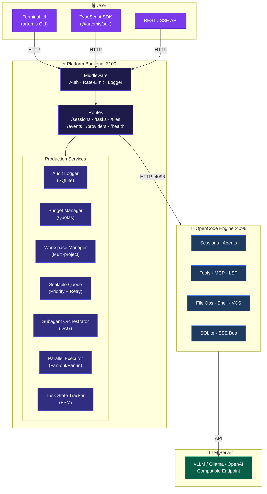

<!-- Artemis — System Architecture -->
<!-- Render with any Mermaid viewer: https://mermaid.live -->

```mermaid
graph TB
    subgraph User["🖥️ User"]
        TUI["Terminal UI<br/>(artemis CLI)"]
        SDK["TypeScript SDK<br/>(@artemis/sdk)"]
        API["REST / SSE API"]
    end

    subgraph Platform["⚡ Platform Backend :3100"]
        direction TB
        MW["Middleware<br/>Auth · Rate-Limit · Logger"]
        Routes["Routes<br/>/sessions · /tasks · /files<br/>/events · /providers · /health"]
        
        subgraph Services["Production Services"]
            Audit["Audit Logger<br/>(SQLite)"]
            Budget["Budget Manager<br/>(Quotas)"]
            WS["Workspace Manager<br/>(Multi-project)"]
            Queue["Scalable Queue<br/>(Priority + Retry)"]
            Orch["Subagent Orchestrator<br/>(DAG)"]
            Para["Parallel Executor<br/>(Fan-out/Fan-in)"]
            Task["Task State Tracker<br/>(FSM)"]
        end
    end

    subgraph Engine["🤖 OpenCode Engine :4096"]
        Sessions["Sessions · Agents"]
        Tools["Tools · MCP · LSP"]
        FileOps["File Ops · Shell · VCS"]
        Storage["SQLite · SSE Bus"]
    end

    subgraph LLM["🧠 LLM Server"]
        vLLM["vLLM / Ollama / OpenAI<br/>Compatible Endpoint"]
    end

    TUI -->|HTTP| MW
    SDK -->|HTTP| MW
    API -->|HTTP| MW
    MW --> Routes
    Routes --> Services
    Routes -->|HTTP :4096| Engine
    Engine -->|API| vLLM

    classDef user fill:#7c3aed,stroke:#5b21b6,color:white
    classDef platform fill:#1e1b4b,stroke:#4338ca,color:white
    classDef engine fill:#1e3a5f,stroke:#2563eb,color:white
    classDef llm fill:#065f46,stroke:#059669,color:white
    classDef service fill:#312e81,stroke:#6366f1,color:white

    class TUI,SDK,API user
    class MW,Routes platform
    class Audit,Budget,WS,Queue,Orch,Para,Task service
    class Sessions,Tools,FileOps,Storage engine
    class vLLM llm
```
