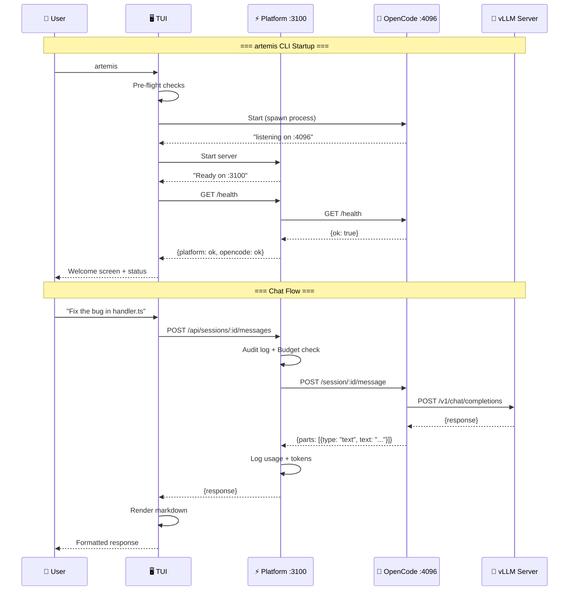

<!-- Artemis — Request Flow -->
<!-- Render with any Mermaid viewer: https://mermaid.live -->

```mermaid
sequenceDiagram
    participant U as 👤 User
    participant TUI as 🖥️ TUI
    participant Plat as ⚡ Platform :3100
    participant OC as 🤖 OpenCode :4096
    participant LLM as 🧠 vLLM Server

    Note over U,LLM: === artemis CLI Startup ===
    
    U->>TUI: artemis
    TUI->>TUI: Pre-flight checks
    TUI->>OC: Start (spawn process)
    OC-->>TUI: "listening on :4096"
    TUI->>Plat: Start server
    Plat-->>TUI: "Ready on :3100"
    TUI->>Plat: GET /health
    Plat->>OC: GET /health
    OC-->>Plat: {ok: true}
    Plat-->>TUI: {platform: ok, opencode: ok}
    TUI-->>U: Welcome screen + status

    Note over U,LLM: === Chat Flow ===

    U->>TUI: "Fix the bug in handler.ts"
    TUI->>Plat: POST /api/sessions/:id/messages
    Plat->>Plat: Audit log + Budget check
    Plat->>OC: POST /session/:id/message
    OC->>LLM: POST /v1/chat/completions
    LLM-->>OC: {response}
    OC-->>Plat: {parts: [{type: "text", text: "..."}]}
    Plat->>Plat: Log usage + tokens
    Plat-->>TUI: {response}
    TUI->>TUI: Render markdown
    TUI-->>U: Formatted response
```
