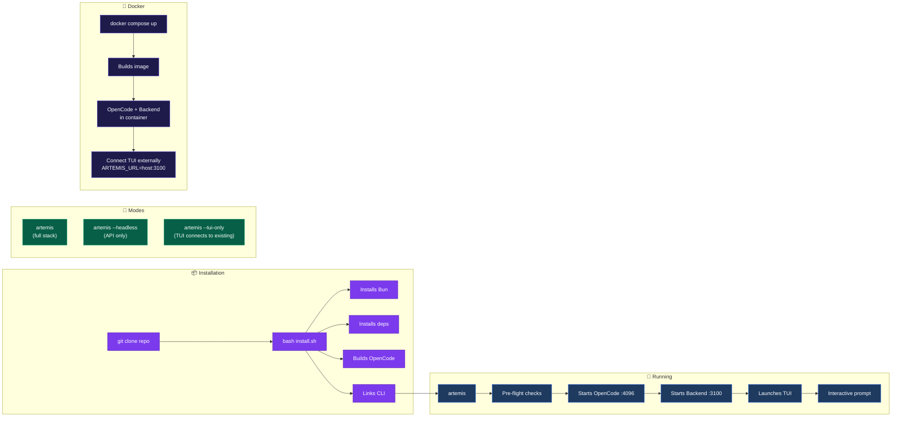

<!-- Artemis — Deployment Workflow -->
<!-- Render with any Mermaid viewer: https://mermaid.live -->

```mermaid
graph LR
    subgraph Install["📦 Installation"]
        A["git clone repo"] --> B["bash install.sh"]
        B --> C["Installs Bun"]
        B --> D["Installs deps"]
        B --> E["Builds OpenCode"]
        B --> F["Links CLI"]
    end

    subgraph Run["🚀 Running"]
        G["artemis"] --> H["Pre-flight checks"]
        H --> I["Starts OpenCode :4096"]
        I --> J["Starts Backend :3100"]
        J --> K["Launches TUI"]
        K --> L["Interactive prompt"]
    end

    subgraph Modes["🔧 Modes"]
        M["artemis<br/>(full stack)"]
        N["artemis --headless<br/>(API only)"]
        O["artemis --tui-only<br/>(TUI connects to existing)"]
    end

    subgraph Docker["🐳 Docker"]
        P["docker compose up"] --> Q["Builds image"]
        Q --> R["OpenCode + Backend<br/>in container"]
        R --> S["Connect TUI externally<br/>ARTEMIS_URL=host:3100"]
    end

    F --> G

    classDef install fill:#7c3aed,stroke:#5b21b6,color:white
    classDef run fill:#1e3a5f,stroke:#2563eb,color:white
    classDef modes fill:#065f46,stroke:#059669,color:white
    classDef docker fill:#1e1b4b,stroke:#4338ca,color:white

    class A,B,C,D,E,F install
    class G,H,I,J,K,L run
    class M,N,O modes
    class P,Q,R,S docker
```
